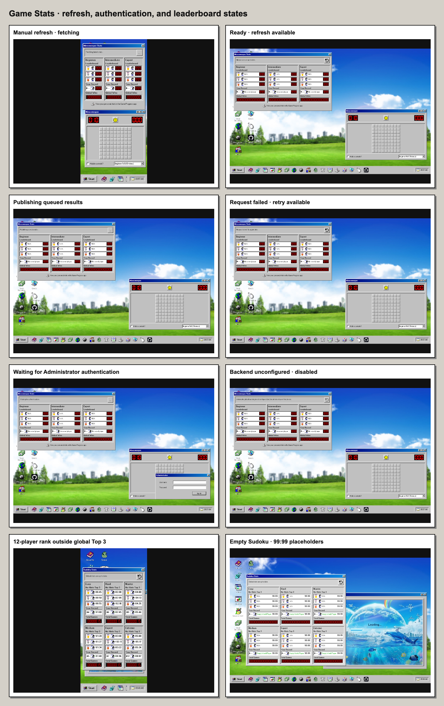

# Game Stats Refresh Control

Purpose: Review and regression-test the shared Game Stats refresh, publishing,
and Administrator-authentication control.

Scope: The status/action row in the Minesweeper, Solitaire, Snake, and Sudoku
stats windows.

Last verified: 2026-07-25



## State Contract

| State | Status copy | Button behavior | Custom loading cursor |
| --- | --- | --- | --- |
| Initial | `Global stats will sync automatically.` | Refresh enabled when the backend is configured. | Off |
| Fetching | `Fetching latest stats...` | Disabled and `aria-busy="true"`. | On only for a manual request |
| Publishing | `Publishing saved results...` | Disabled and `aria-busy="true"`. | On only for a manual request |
| Authentication required | `Sign in as Administrator to publish your verified Rohin result.` | Opens the Administrator dialog directly. | Off |
| Authentication waiting | `Waiting for authentication...` | Disabled and `aria-busy="true"`. | On |
| Ready | `Global stats are up to date.` | Refresh enabled. | Off |
| Request failed | `Request failed. Try again later.` | Retries the failed refresh, or reopens Administrator directly when authentication failed. | Off |
| Unconfigured | `Automatic global tracking is not configured yet; local stats stay on this device.` | Disabled because no useful network action exists. | Off |

All visible Game Stats windows render the same state and share one coalesced
request. Only the initiating visible status uses `aria-live="polite"`; duplicate
visible copies use `aria-live="off"`. Animated dots are decorative, remain one
atomic announcement, and become static under reduced motion.

The refresh action stays right-aligned inside the shared sunken status strip
and uses the bundled Solitaire undo icon.

Canceling Administrator sign-in restores the initiating refresh button when it
is still visible, otherwise focus moves to another visible refresh action or
the Start button. Closing the dialog also aborts and invalidates its request, so
a delayed response cannot grant access, reset local data, or open the success
alert.

A successful Administrator sign-in clears this browser's saved profile and
local game aggregates, clears Snake high scores, replaces any prior Sudoku save
with a fresh easy puzzle, then installs the protected profile. It deliberately
keeps already published global data and the verified-result sync queue, so a
pending protected result can still publish. The opaque proof remains only in
the current tab's session storage. The centered success alert uses the annoying
popup shape and bundled `msg_warning.ico` warning-triangle icon, contains only
`Administrator access granted.`, and provides one right-aligned `OK` button.

## Repeatable Verification

Run the source contracts and the rendered state suite:

```bash
node --test tests/game-stats-refresh-control.test.mjs \
  tests/game-stats-frontend-contract.test.mjs \
  tests/administrator-sign-in.test.mjs
npx playwright test tests/ui/game-stats-refresh-control.spec.mjs \
  tests/ui/administrator-sign-in.spec.mjs
```

The rendered suite covers 375×812 and 1280×800, exact copy, animated/busy
semantics, the loading cursor, queue publication, request failure, backend
absence, shared/coalesced requests, Administrator cancel/success races, focus,
and horizontal overflow.
